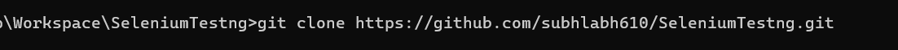
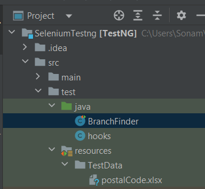
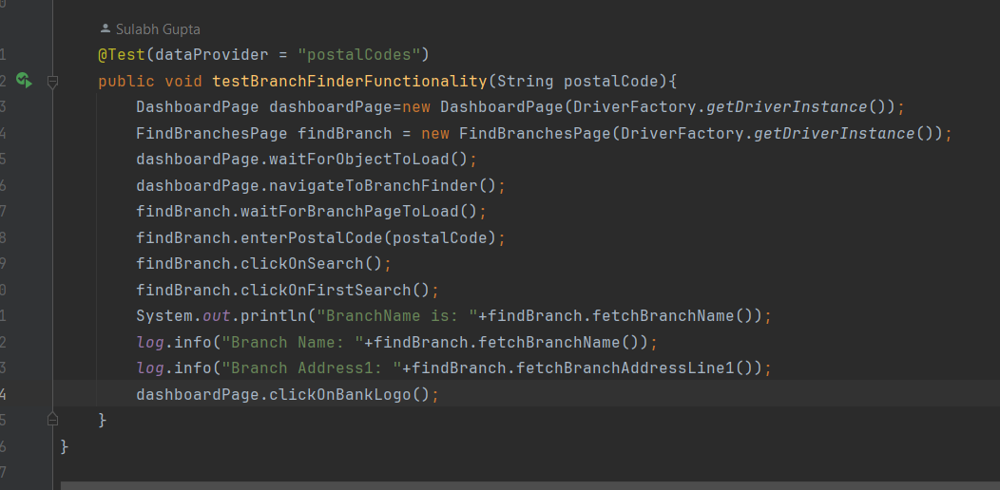
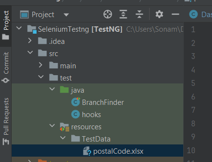

# TestNG Framework

This repository contains a TestNG-based testing framework used for Automating the UI test scenarios.
Singleton Design pattern is used to create the Driver Instance, and Page object model to create the locators and methods.
Slf4j logger is used to log the informations.
This document provides an overview of the framework, how to set it up, and how to run the tests.

## Pre-requisite

1) Java 8 or above
2) Maven

Installation
To get started, you need to set up TestNG in your Maven project. Follow these steps:

Clone the Repository (if applicable):

TestCase Execution:

  

TestData file:

